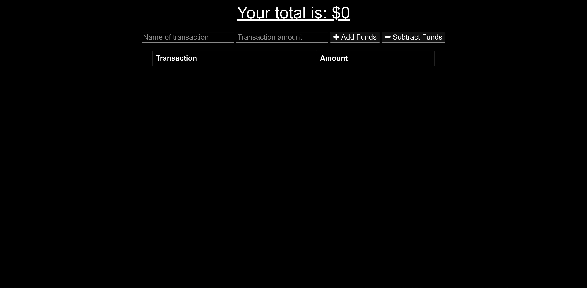
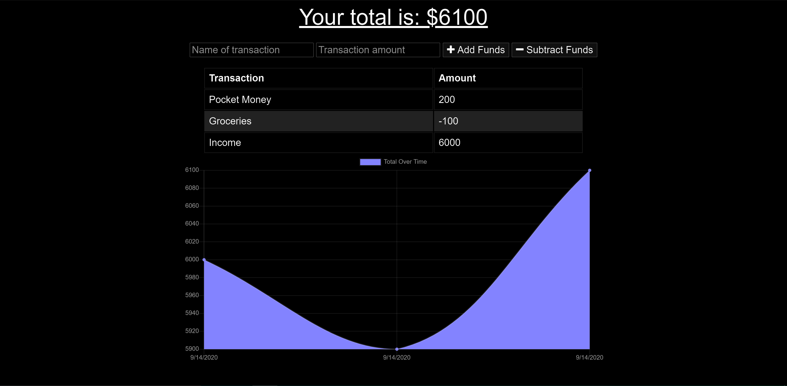
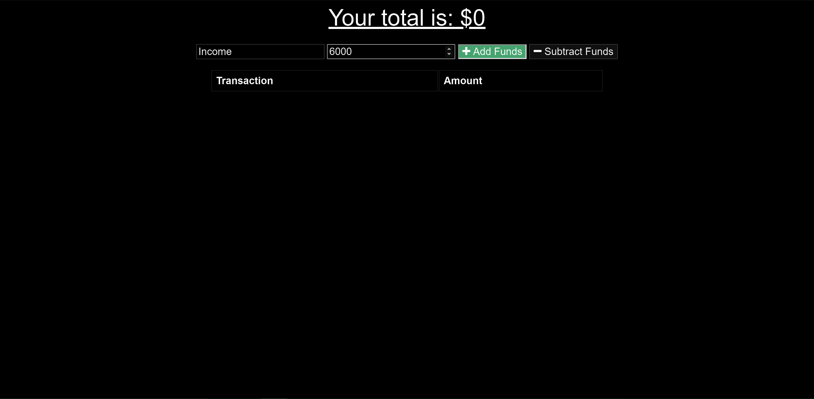
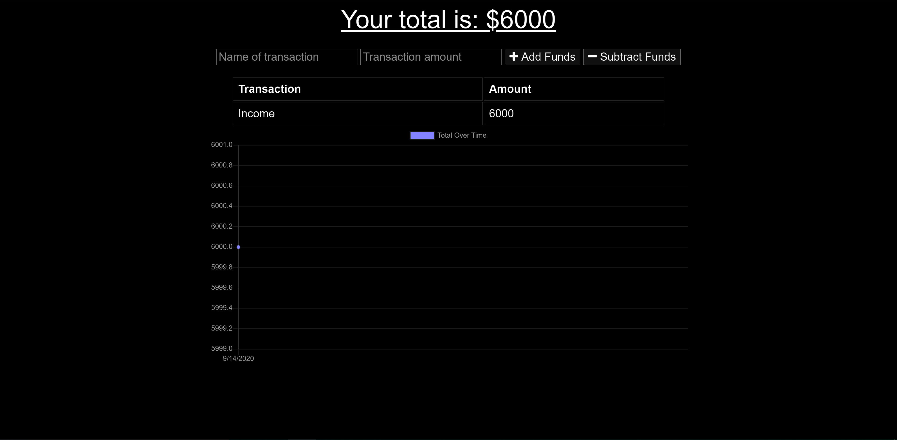
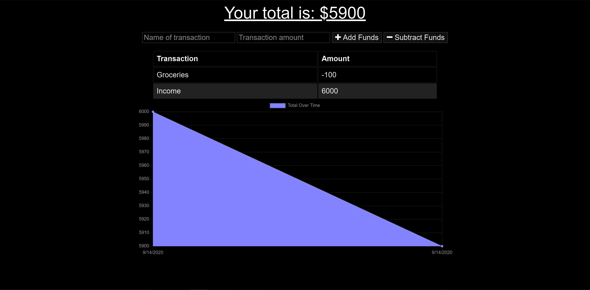

# MBC-Online-Offline-BudgetTracker

## Application & Repository Link

###### [Application Link](https://fathomless-garden-87120.herokuapp.com/)

###### [Repository Link](https://github.com/Suji-GitH/MBC-Online-Offline-BudgetTracker)

## Content
- [Overview](#Overview)
- [Acceptance Criteria](#Acceptance-Criteria)
- [Application Screens](#Application-Screens)
- [Installation](#Installation)
- [Credits](#Credits)

## Overview

```
AS AN avid traveller
I WANT to be able to track my withdrawals and deposits with or without a data/internet connection
SO THAT my account balance is accurate when I am traveling
```

## Acceptance Criteria

GIVEN a user is on Budget App without an internet connection
WHEN the user inputs a withdrawal or deposit
THEN that will be shown on the page, and added to their transaction history when their connection is back online.

## Installation

1. Download/Clone this GitHub repository.
2. Install dependencies via npm i. 
3. Run the app through node.js by npm start.

## Application-Screens

###### App Screenshots

Landing Page

* Without Data


* With Data


Add Transaction




Subtract Transaction




## Credits

- Heroku
- MongoDB
- Mongooes
- Morgan
- node.js
